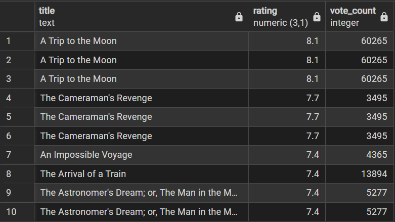
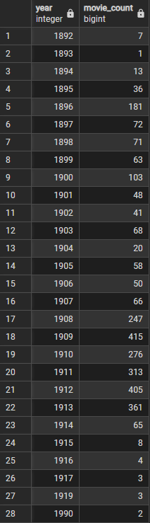
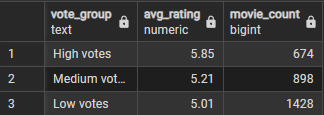
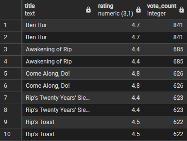

# 🎬 Movie Analytics Data Warehouse

A professional end-to-end Data Engineering project implementing a Star Schema Data Warehouse using IMDB datasets and Python ETL.

---

## 🚀 Project Overview

This project demonstrates how to design and build a scalable Movie Analytics Data Warehouse using:

- Python (ETL pipeline)
- PostgreSQL (Data Warehouse)
- SQL (Analytical queries)
- Pandas (Data transformation)

Workflow:
1. Extract raw IMDB data
2. Clean and transform data
3. Load into PostgreSQL Star Schema
4. Run analytical SQL queries

---

## 📊 Sample Analytical Queries & Results

---

### 🔝 Top Movies by Rating (Min 100 Votes)


```sql
SELECT
    m.title,
    f.rating,
    f.vote_count
FROM fact_movie_performance f
JOIN dim_movie m ON f.movie_id = m.movie_id
WHERE f.vote_count >= 100
ORDER BY f.rating DESC
LIMIT 10;
```



### 📈 Average Rating by Decade

```sql
SELECT
    d.decade,
    ROUND(AVG(f.rating), 2) AS avg_rating,
    COUNT(*) AS movie_count
FROM fact_movie_performance f
JOIN dim_date d ON f.date_id = d.date_id
GROUP BY d.decade
ORDER BY d.decade;
```


### 🎥 Movies Produced per Year

```sql
SELECT
    d.year,
    COUNT(*) AS movie_count
FROM fact_movie_performance f
JOIN dim_date d ON f.date_id = d.date_id
GROUP BY d.year
ORDER BY d.year;
```



### 🗳️ Rating vs Vote Segmentation

```sql
SELECT
    CASE
        WHEN f.vote_count < 50 THEN 'Low votes'
        WHEN f.vote_count BETWEEN 50 AND 200 THEN 'Medium votes'
        ELSE 'High votes'
    END AS vote_group,
    ROUND(AVG(f.rating), 2) AS avg_rating,
    COUNT(*) AS movie_count
FROM fact_movie_performance f
GROUP BY vote_group
ORDER BY avg_rating DESC;
```



### ⚠️ High Votes but Low Rating

```sql
SELECT
    m.title,
    f.rating,
    f.vote_count
FROM fact_movie_performance f
JOIN dim_movie m ON f.movie_id = m.movie_id
WHERE f.vote_count >= 100
  AND f.rating < 5
ORDER BY f.vote_count DESC
LIMIT 10;
```

