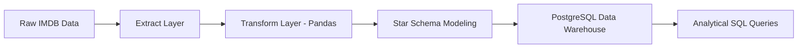
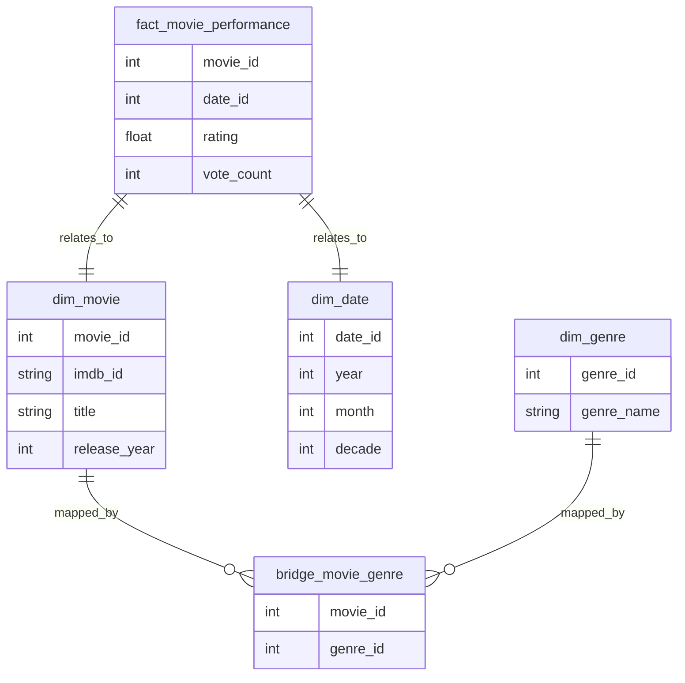

# 🎬 Movie Analytics Data Warehouse

An end-to-end **Data Engineering project** that builds a Movie Analytics Data Warehouse using a **Star Schema design**, powered by **Python ETL and PostgreSQL**.

This project demonstrates practical data warehousing concepts including dimensional modeling, ETL pipelines, bulk data loading, and analytical SQL queries.

---

## 🚀 Project Overview

This project simulates a production-style data warehouse built from cleaned IMDB movie datasets.

Pipeline steps:

1. Extract raw movie data  
2. Transform and clean using Pandas  
3. Design and implement a Star Schema  
4. Load structured data into PostgreSQL  
5. Run analytical SQL queries  

The goal is to demonstrate real-world skills in:

- Data Modeling  
- ETL Development  
- SQL Analytics  
- PostgreSQL  
- Structured Project Architecture  

---

## 🏗️ Architecture Overview

### 🔁 Data Flow Diagram


```mermaid
flowchart LR
    A[Raw IMDB Data] --> B[Extract Layer]
    B --> C[Transform Layer - Pandas]
    C --> D[Star Schema Modeling]
    D --> E[PostgreSQL Data Warehouse]
    E --> F[Analytical SQL Queries]
```

---

## 🧱 Star Schema Design


```mermaid
erDiagram

    fact_movie_performance {
        int movie_id
        int date_id
        float rating
        int vote_count
    }

    dim_movie {
        int movie_id
        string imdb_id
        string title
        int release_year
    }

    dim_date {
        int date_id
        int year
        int month
        int decade
    }

    dim_genre {
        int genre_id
        string genre_name
    }

    bridge_movie_genre {
        int movie_id
        int genre_id
    }

    fact_movie_performance ||--|| dim_movie : relates_to
    fact_movie_performance ||--|| dim_date : relates_to
    dim_movie ||--o{ bridge_movie_genre : mapped_by
    dim_genre ||--o{ bridge_movie_genre : mapped_by
```

---

## 📁 Project Structure

```
movie-analytics-data-warehouse/
│
├── data/
│   ├── raw/
│   │   └── imdb/
│   └── processed/
│
├── etl/
│   ├── extract.py
│   ├── transform.py
│   ├── load.py
│   └── logger_config.py
│
├── sql/
│   ├── schema.sql
│   └── example_queries.sql
│
├── tests/
│   ├── test_extract.py
│   ├── test_transform.py
│   └── test_load.py
│
├── logs/
├── assets/
├── notebooks/
├── .env.example
├── requirements.txt
└── README.md
```

---

## ⚙️ Installation & Setup

### 1️⃣ Clone Repository

```bash
git clone https://github.com/saeidmoradi1998/movie-analytics-data-warehouse.git
cd movie-analytics-data-warehouse
```

### 2️⃣ Create Virtual Environment

```bash
python -m venv venv
venv\Scripts\activate
```

### 3️⃣ Install Dependencies

```bash
pip install -r requirements.txt
```

### 4️⃣ Configure Environment Variables

```bash
copy .env.example .env
```

Then open `.env` and fill in your PostgreSQL credentials.

### 5️⃣ Setup PostgreSQL Database

```bash
createdb movie_dw
psql movie_dw -f sql/schema.sql
```

### 6️⃣ Run ETL Pipeline

```bash
python etl/extract.py
python etl/transform.py
python etl/load.py
```

### 7️⃣ Run Tests

```bash
pytest
```

---

## 📊 Example Analytical Queries

### 🔝 Top Movies by Rating (Min 100 Votes)

```sql
SELECT m.title,
       f.rating,
       f.vote_count
FROM fact_movie_performance f
JOIN dim_movie m ON f.movie_id = m.movie_id
WHERE f.vote_count >= 100
ORDER BY f.rating DESC
LIMIT 10;
```

### 📈 Average Rating by Decade

```sql
SELECT d.decade,
       ROUND(AVG(f.rating),2) AS avg_rating
FROM fact_movie_performance f
JOIN dim_date d ON f.date_id = d.date_id
GROUP BY d.decade
ORDER BY d.decade;
```

### 🎭 Top Genres by Average Rating

```sql
SELECT g.genre_name,
       ROUND(AVG(f.rating),2) AS avg_rating
FROM fact_movie_performance f
JOIN bridge_movie_genre b ON f.movie_id = b.movie_id
JOIN dim_genre g ON b.genre_id = g.genre_id
GROUP BY g.genre_name
ORDER BY avg_rating DESC;
```

---

## 🔍 Engineering Highlights

- Star Schema optimized for analytical workloads  
- Proper handling of many-to-many relationships  
- Clear separation of ETL layers  
- Bulk inserts for performance  
- Referential integrity with foreign keys  
- Scalable project structure  

---

## 📈 Future Improvements

- Add indexing optimization  
- Dockerized PostgreSQL setup  
- CI/CD for ETL pipeline  
- TMDB data source integration  
- BI dashboard integration (e.g. Metabase / Power BI)  

---

## 🛠 Tech Stack

- Python  
- Pandas  
- PostgreSQL  
- SQL  
- psycopg2  
- pytest  
- Git  

---

## 👤 Author

Saeid Moradi  
MSc Digital Technologies – Data Engineering & Analytics  

GitHub: https://github.com/saeidmoradi1998  
